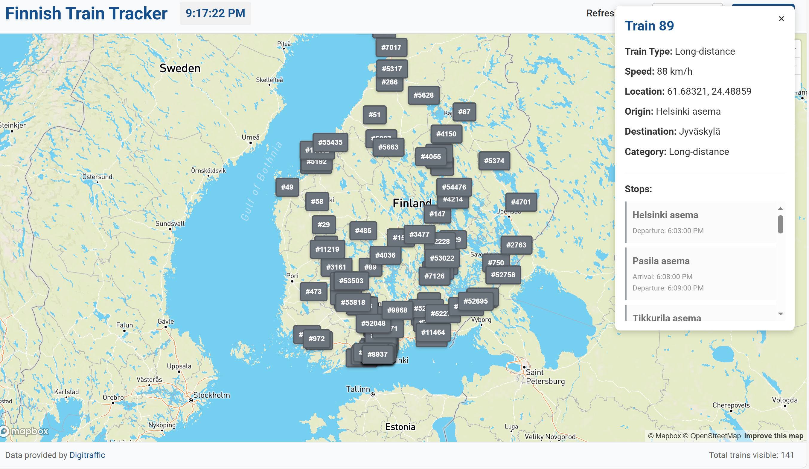

# Finnish Train Tracker

A real-time visualization application that displays current train locations in Finland on an interactive map, built with React and Mapbox GL JS.



## Project Overview

This application demonstrates how to create a digital marketplace-like interface for transportation data, similar to the concept needed for the DigiBiogasHubs project. It pulls real-time data from the Finnish Transport Infrastructure Agency's open API (Digitraffic) and presents it in an intuitive, interactive map interface.

## Features

### Core Functionality
- **Real-time Train Location Data**: Fetches current positions of all trains in Finland from the Digitraffic API
- **Interactive Map Visualization**: Displays train positions on a responsive Mapbox map centered on Finland
- **Automatic Updates**: Refreshes train location data at configurable intervals (5s to 60s)
- **Train Type Identification**: Color-coded train markers for different types of trains:
  - Blue: Intercity and high-speed trains
  - Orange: Commuter trains
  - Green: Passenger trains
  - Gray: Cargo trains

### Detailed Information Display
- **Train Details Panel**: Click on any train to see detailed information including:
  - Train number and full type name
  - Current speed
  - Geographic coordinates
  - Origin and destination stations (with full station names)
  - Train category
  - Commuter line ID (where applicable)

### User Interface
- **Clean, Intuitive Design**: Modern interface with Finnish design influences
- **Responsive Layout**: Works seamlessly on both desktop and mobile devices
- **Interactive Controls**: User can adjust refresh rate and manually refresh data
- **Visual Loading Indicators**: Clear feedback when data is being loaded

## Technical Architecture

### Data Flow
1. **API Integration**: The application connects to two main Digitraffic API endpoints:
   - `/train-locations/latest`: Provides current positions of all active trains
   - `/trains/latest/{train_number}`: Provides detailed information for a specific train
   - `/metadata/stations`: Retrieves full information about all railway stations

2. **Data Processing**:
   - Train position data is parsed and formatted for map visualization
   - Station codes are mapped to full station names for better readability
   - Train type codes are translated to descriptive names

3. **Visualization**:
   - Mapbox GL JS renders the map and manages map interactions
   - Custom markers display train positions and reflect train types through color coding
   - Automatic updates maintain data freshness without page reloads

### Component Structure
- **App**: Main component that orchestrates the entire application
- **Map Container**: Houses the Mapbox map and train markers
- **Controls**: User interface for adjusting refresh rate and triggering manual updates
- **Train Info Panel**: Displays detailed information about the selected train

## Technologies Used

### Frontend
- **React.js**: Core application framework
- **Mapbox GL JS**: Map rendering and interaction library
- **Axios**: HTTP client for API requests
- **CSS3**: Custom styling with responsive design principles

### APIs
- **Digitraffic Railway API**: Source for real-time train data
- **Mapbox API**: Map rendering service

### Development Tools
- **Create React App**: Application scaffolding and build system
- **Git/GitHub**: Version control
- **npm**: Package management

## Installation and Setup

### Prerequisites
- Node.js (v14.0.0 or newer)
- npm or yarn
- Mapbox account with public access token

### Step-by-Step Installation
1. **Clone the repository**
   ```bash
   git clone https://github.com/your-username/finnish-train-tracker.git
   cd finnish-train-tracker
   ```

2. **Install dependencies**
   ```bash
   npm install
   ```

3. **Configure environment variables**
   - Create a `.env` file in the project root
   - Add your Mapbox token:
     ```
     REACT_APP_MAPBOX_TOKEN=pk.your_public_mapbox_token
     ```
   - Ensure your token starts with `pk.` (public token), not `sk.` (secret token)

4. **Run the application**
   ```bash
   npm start
   ```

5. **Open in browser**
   - Navigate to `http://localhost:3000`

## API Integration Details

### Digitraffic API
The application uses the open data provided by the Finnish Transport Infrastructure Agency through their Digitraffic service:

1. **Train Locations Endpoint**
   - URL: `https://rata.digitraffic.fi/api/v1/train-locations/latest`
   - Method: GET
   - Response: Array of train objects with location coordinates, speed, and train identifiers

2. **Train Details Endpoint**
   - URL: `https://rata.digitraffic.fi/api/v1/trains/latest/{train_number}`
   - Method: GET
   - Response: Detailed information about a specific train including route, schedule, and type

3. **Stations Metadata Endpoint**
   - URL: `https://rata.digitraffic.fi/api/v1/metadata/stations`
   - Method: GET
   - Response: List of all railway stations with codes and full names

### Mapbox Integration
The application leverages Mapbox GL JS for map visualization:

- Uses vector tile-based rendering for smooth performance
- Implements custom markers for train positions
- Provides interactive features (zoom, pan, click)
- Maintains a responsive design on various screen sizes

## Code Structure and Implementation

### Key Files
- `src/App.js`: Main application component
- `src/App.css`: Custom styling
- `public/index.html`: HTML template
- `.env`: Environment variables (not committed to Git)

### Data Management
The application manages several types of state:
- Train position data
- Selected train details
- Station metadata
- UI state (loading, error conditions)

### Performance Considerations
- Map markers are efficiently updated (only changed markers are modified)
- API requests are batched and rate-limited
- Resource cleanup is performed when components unmount

## Security Considerations

- Mapbox token is stored in environment variables, not hardcoded
- No sensitive data is collected or stored
- API requests include appropriate headers
- Error handling prevents exposure of technical details

## Future Enhancements

Potential improvements for further development:

1. **Train Routes Visualization**: Display the planned route of selected trains
2. **Search Functionality**: Allow users to search for specific trains by number or destination
3. **Time-based Filtering**: Filter trains by departure/arrival times
4. **Station Information**: Show station details and upcoming arrivals/departures
5. **Delay Information**: Highlight delayed trains with additional information
6. **Historical Data**: Track and visualize historical movement of trains
7. **Offline Support**: Implement Progressive Web App features for offline capability
8. **Multi-language Support**: Add language options for Finnish, Swedish, and English

## Contribution Guidelines

If you'd like to contribute to this project:

1. Fork the repository
2. Create a feature branch (`git checkout -b feature/amazing-feature`)
3. Commit your changes (`git commit -m 'Add some amazing feature'`)
4. Push to the branch (`git push origin feature/amazing-feature`)
5. Open a Pull Request

## License

This project is licensed under the MIT License - see the LICENSE file for details.

## Acknowledgements

- Data provided by [Digitraffic](https://www.digitraffic.fi/), Finnish Transport Infrastructure Agency
- Map visualization powered by [Mapbox](https://www.mapbox.com/)
- Readme template inspired by Best-README-Template

---

Created by [Your Name] for the RDI Assistant position at Centria's Chemistry and Bioeconomy team.
